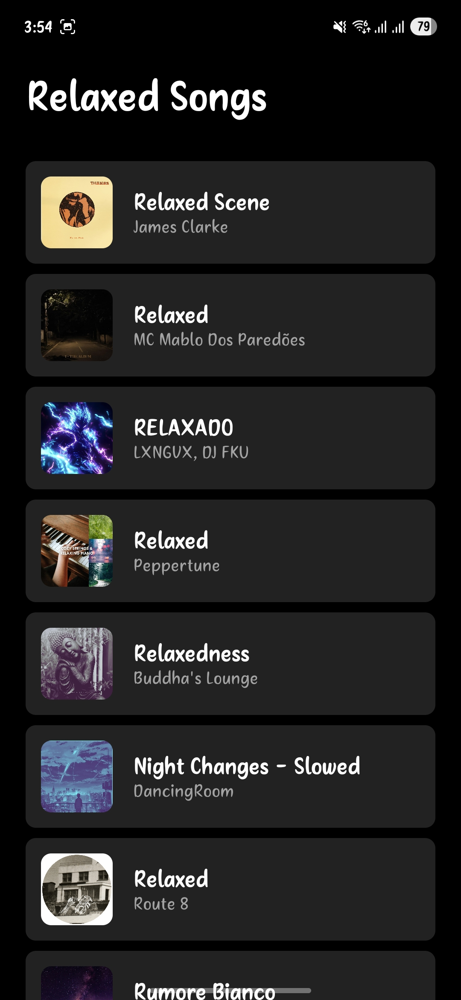
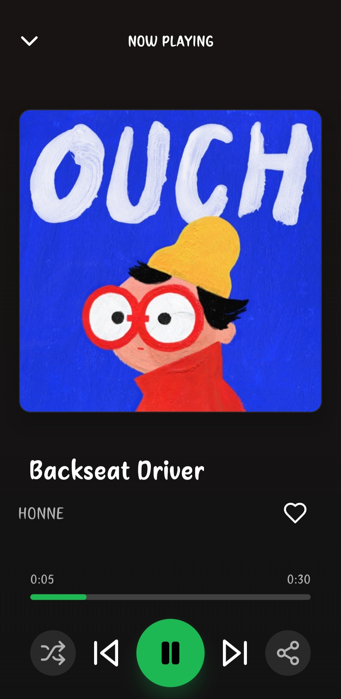

# 🚀 MoodMusicApp

*A beautiful, mood-based music player powered by the Spotify API.*

---

## 📸 Screenshots

| Home Page | Playlist | Player |
|-----------|----------|--------|
|  |  |  |

---

## ✨ Purpose of the App

> MoodMusicApp helps users discover and play music based on their current mood. Instantly search Spotify, explore new releases, and enjoy a modern, Spotify-inspired player UI. Built for music lovers who want a simple, beautiful, and mood-driven listening experience.

---

## 🛠 Tech Stack

- **Frontend:** React Native (Expo)
- **APIs:** Spotify Web API
- **UI:** Custom, inspired by Spotify
- **Other:** AsyncStorage, React Navigation, Expo Linear Gradient, Lucide Icons

---

## 🤝 Collaborators

| Name            | GitHub                                                 | Email                     |
|-----------------|--------------------------------------------------------|---------------------------|
| Asim Rana       | [@asim1909](https://github.com/asim1909)               | work.asimrana@gmail.com   |
| Sudheer kumar   | [@Kumar-sudheer](https://github.com/Kumar-sudheer)     | kumarsudheer0812@gmail.com|
| Akash Mishra    | [@akashmishra8532](https://github.com/akashmishra8532) | akashmishra0389@gmail.com |


---

## 📚 What We Learned

- How to build a modern mobile UI with React Native and Expo
- Integrating with the Spotify API for real music data
- Handling search, new releases, and playlist navigation
- Creating animated UI (marquee text, swipe gestures)
- Managing state and context for a music player

---

## 🚧 Installation & Running Locally

```bash
git clone https://github.com/asim1909/moodMusic.git
cd moodMusic
npm install
npm start
```

---

## 🔑 Environment Variables (.env)

Create a `.env` file in the root of your project with the following structure:

```env
SPOTIFY_CLIENT_ID=your_spotify_client_id
SPOTIFY_CLIENT_SECRET=your_spotify_client_secret
```

> You can get these values from your Spotify Developer Dashboard: https://developer.spotify.com/dashboard

**Never commit your .env file to version control!**

---

## 🎵 Features

- Theme customization (light/dark mode toggle on Home screen, applies to all screens)
- 🎧 Mood-based playlists and discovery
- 🔍 Live Spotify search (no mock data!)
- 🆕 New releases from Spotify
- 🕹️ Modern player UI: shuffle, next/prev, animated titles
- ❤️ Favorites, recommendations, and more

---

## 📄 License

MIT 
